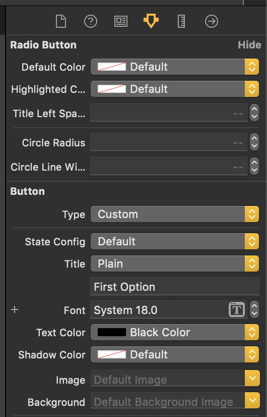

# Group RadioButton


###Sample Code
Sample code would look like this

```
class ViewController: UIViewController, RadioGroupDelegate {
    
    @IBOutlet private weak var firstButton: RadioButton!
    @IBOutlet private weak var secondButton: RadioButton!
    @IBOutlet private weak var thirdButton: RadioButton!
    
    private var groupController: RadioGroupController?

    override func viewDidLoad() {
        super.viewDidLoad()
        
        groupController = RadioGroupController(buttons: [firstButton, secondButton, thirdButton])
        groupController?.delegate = self
        
    }

    func didSelectedButton(_ index: Int?, value: String?) {
        print("Index => \(index), selected value => \(value)")
    }

}

```

### Programmatically

```
class ViewController: UIViewController, RadioGroupDelegate {
    
    @IBOutlet private weak var firstButton: RadioButton!
    @IBOutlet private weak var secondButton: RadioButton!
    @IBOutlet private weak var thirdButton: RadioButton!
    
    private var groupController: RadioGroupController?

    override func viewDidLoad() {
        super.viewDidLoad()
        
        groupController = RadioGroupController()
        
        // Step 1 with group id
        groupController.addButtons([firstButton, secondButton, thirdButton], groupId: "") 
        groupController?.delegate = self
        
        // Step 2 with group id and multiselection
        
        groupController.addButtons([firstButton, secondButton, thirdButton], groupId: "", isMultiSelectionEnabled: Bool) 
        groupController?.delegate = self
        
    }

    func didSelectedButton(_ index: Int?, value: String?) {
        print("Index => \(index), selected value => \(value)")
    }

}

```


## Demo


### Get currently selected button
To get the currently selected button, you can use 

```
var currentButton = groupController.selectedButton
```

To get the currently selected button index, you can use 

```
var selectedIndex = groupController.selectedIndex
```

To get the currently selected button value, you can use 

```
var selectedValue = groupController.selectedValue
```

To get the currently selected group id, you can use 

```
var selectedValue = groupController.selectedGroupId
```

## 🎨 Customization

#### default color
```swift
    firstButton.defaultColor = UIColor.black
```

#### highlightedColor color
```swift
    firstButton.highlightedColor = UIColor.red
```

#### title left space
```swift
    firstButton.titleLeftSpace = 50
```

We can assign these properties through XIB



#### Note

UIButton type should be custom
